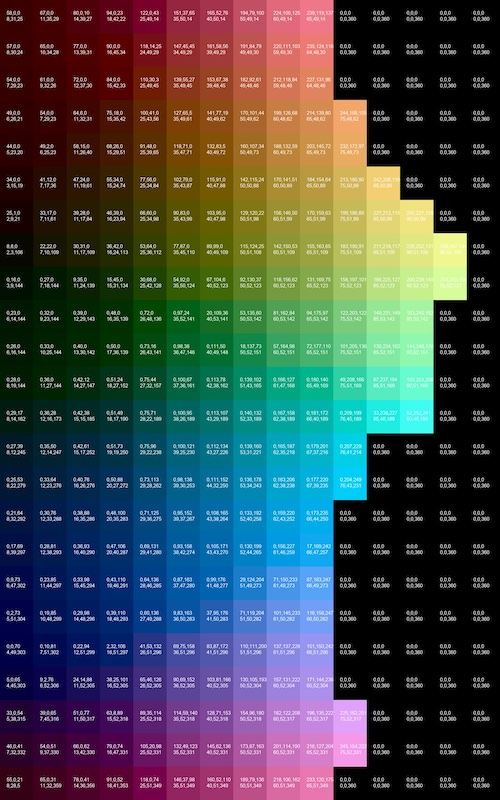
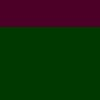

## To get an idea of LCH

`lch.show_ch_swatch(x)` will show LCH color palette for given chroma (saturation):

## Histograms

`hist.draw_hue_hist(colors_arr)` will show a proportional palette of the image like this:

